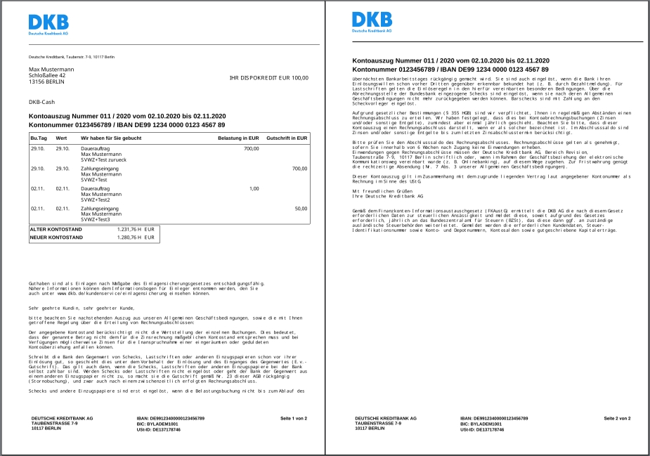
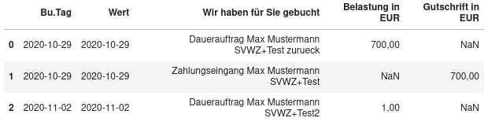

# dkb-parser
A simple python script to parse the monthly bank statement pdf (Kontoauszug) of Deutsche Kreditbank (DKB) .


## Usage
You can find an example pdf-file in the repo as well as the notebook `example.ipynb` showing the below example in action.

The input-pdf looks as follows:

  

Import the class `Kontoauszug` from the single python file and provide a path to the pdf:

```python
from read_pdf_table import Kontoauszug
f = "Kontoauszug_1061733174_Nr_2020_011_per_2020_11_02 (copy).pdf"
auszug = Kontoauszug(f)
print(auszug.df)
```

The result is now a panda.DataFrame saved in the `df` attribute of the Kontoauszug object. Here it is printed in a jupyter notebook:



For batch processing many bank statements we can use joblib to parallelize the parsing:

```python
# with joblib parallelization:
from joblib import Parallel, delayed
from tqdm_joblib import tqdm_joblib

with tqdm_joblib(desc="read pdf files", total=len(files)) as progress_bar:
    kas = Parallel(n_jobs=4)(delayed(Kontoauszug)(f) for f in files)
```

## Features
- single python script 
- parse monthly pdf files to panda dataframes
- CSV/xlsx export (other panda export functions are easy to extend) 
- no need of selenium or other web browser 
- no need to enter any bank account info

There are some alternatives out there but they require either a complex selenium setup or the availability of csv exports of the bank statements or other dependencies with did not reliably work for me. Also I don't want to enter my bank login details into some github script and also don't want to manually download the csv file for each month. I guess I could have downloaded a csv for my complete banking history each time and divide it into months via python but that wouldn't be as fun as this little project. Since I always download the bank statements as pdfs anyways I needed a script to convert those pdfs into a more accessible format i.e. csv, xlsx... This script prodives just that and not more by only using simple text based methods so no fancy OCR ect. 

## Installation

For now you can just copy the script and place it somewhere. I am planning to add a pip-installable version of this script as well.

## Requirements

* python3
* [tabula-py 2.6.0](https://pypi.org/project/tabula-py/)
* [tabula-java](https://github.com/tabulapdf/tabula-java)
* [pdfminer.six](https://pypi.org/project/pdfminer.six/)
* [pandas](https://pypi.org/project/pandas/)

## Performance

The script needs around 1 second for a moderate pdf (6 pages) on one cpu and thus is not the fastest solution. But all tables are correctly recognized and I had no parsing error yet.

## How it works

I use `pdfminer.six` to access all elements in the pdf in XML format. In those pdf elements we can find lines matching the table border. However long lines sometimes appear as splitted elements, so we merge them in a meaningful way and can obtain the table coordinates in the pdf which we pass to tabula which performs the actual parsing into a tabular structure. On the resulting pandas datafram we perform some additional clean up to have a nice result.


## TODO

* add proper package structure to make it installable with setup.py, requirements.txt ect...
* add code for command line usage

## Alternatives:

* [dkbparse](https://github.com/robbeofficial/dkbparse): I had problems installing the depedency `pdftotext` and even after managing to install that my bank statement was not recognized at all.
* [DKB bank account parser](https://github.com/LuisLuettgens/Bank-account-parser): This needed the csv file and thus did not fit into my workflow. Also parsing the csv file can be easily done with [`pandas.read_csv`](https://pandas.pydata.org/pandas-docs/stable/reference/api/pandas.read_csv.html) . Though the mentioned repository does more than that.
* [DKBBanking](https://github.com/Skasselbard/DKBBanking): I did not try that but it seems to rely on `pdftotext` again and also involves more complex integration with  influxDB and visualization in graphana 
* [dkb-robo](https://github.com/grindsa/dkb-robo): I did not try that either due to privacy concerns since I did not invest any time in checking their large code base.